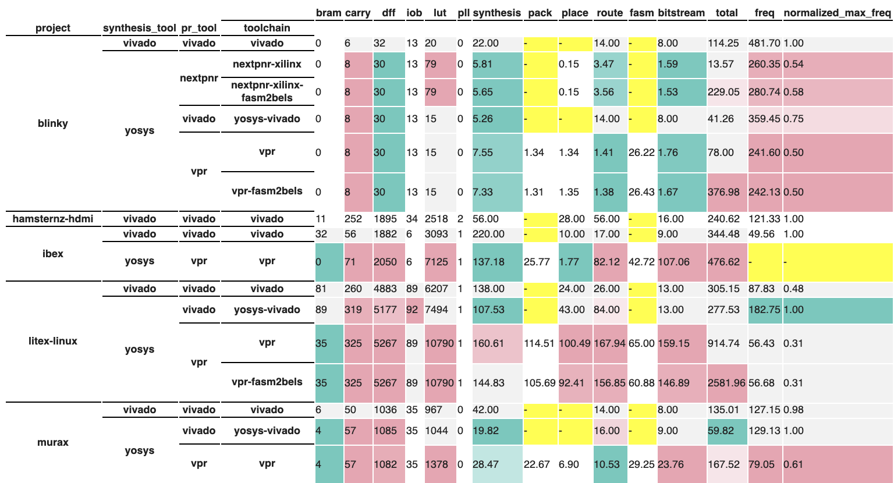

.. _intro-firststeps:

===========
First Steps
===========

FTPVL works best when installed in an interactive Python environment, such as a 
`Jupyter`_ notebook. Many of the examples in the documentation will be accessible
through notebooks hosted on `Google Colaboratory`_.

You can follow along with the steps below by running the cells in 
`this colab notebook`_.

.. _intro-installing:

Installing FTPVL
================

.. note::
    It's recommended to set up a `virtual environment`_ before installing FTPVL
    to prevent future issues with system-wide packages.

Let's get started by installing FTPVL. The easiest way is to download it using 
`PyPi`_::

    pip install ftpvl

In a Python notebook, you can also perform command-line operations by writing the
the command into a cell prefixed with an ``!``:

.. code-block::
    :lineno-start: 1

    !pip install ftpvl

Now, let's import the classes that we will need to complete this tutorial:

.. code-block:: python
    :lineno-start: 2
    
    from ftpvl.fetchers import HydraFetcher
    from ftpvl.processors import *
    from ftpvl.styles import ColorMapStyle
    from ftpvl.visualizers import SingleTableVisualizer

.. _intro-fetching:

Fetching Data from Hydra
========================

:ref:`topics-fetchers` in FTPVL are responsible for ingesting data from a source
and performing simple pre-processing to standardize the output. This results in
the creation of an :ref:`topics-evaluation` instance, which stores the fetched 
test results for a single execution of the testing suite.

The most common place to fetch test results is from `Hydra`_. To accomplish this,
we use the ``HydraFetcher``.

We first must specify a set of mappings between the JSON object properties provided
by Hydra and the desired metric name. This metric name will be used to reference
the field for all future processing.

.. note::
    Hydra provides test results as nested JSON objects. This is decoded by
    ``HydraFetcher`` and *flattened* to make it easier to reference nested
    performance metrics using a string. You can reference a nested metric
    by delimiting each metric to index into with a ``.``. 

.. code-block:: python
    :lineno-start: 6

    # mappings from Hydra JSON object properties to metric names
    df_mappings = {
        "project": "project",
        "device": "device",
        "toolchain": "toolchain",
        "resources.BRAM": "bram",
        "resources.CARRY": "carry",
        "resources.DFF": "dff",
        "resources.IOB": "iob",
        "resources.LUT": "lut",
        "resources.PLL": "pll",
        "runtime.synthesis": "synthesis",
        "runtime.packing": "pack",
        "runtime.placement": "place",
        "runtime.routing": "route",
        "runtime.fasm": "fasm",
        "runtime.bitstream": "bitstream",
        "runtime.total": "total"
    }

Next, we can specify the clock names to use when parsing the Hydra JSON results.
Since different tests might contain one or more clock frequencies, we specify
a list that is used when deciding which clock frequency to use.

.. code-block:: python
    :lineno-start: 25

    # the ordered list of clock names to reference
    hydra_clock_names = ["clk", "sys_clk", "clk_i"]

We can now use those variables as parameters for the ``HydraFetcher``. To get
the latest `evaluation`_, set ``eval_num`` to ``0``. We set ``eval_num`` to ``2``
since it is the latest evaluation (as of this writing) that passes at least one 
test case.

.. warning::
    The ``eval_num`` parameter must reference an `evaluation`_ with at least one 
    passing test. Without this, HydraFetcher will raise a ``ValueError``.

.. code-block:: python
    :lineno-start: 27

    eval1 = HydraFetcher(
        eval_num=2, 
        mapping=df_mappings, 
        hydra_clock_names=hydra_clock_names
    ).get_evaluation()

.. _intro-processing:

Processing Data
===============

After fetching the data, we will need to process the raw data to extract
meaningful results that can be visualized. FTPVL performs processing through
the use of a processing pipeline, which applies consecutive transformations
to arrive at the desired output.

The pipeline is constructed as a list of :ref:`topics-processors`, which are
the primitive transformations implemented in FTPVL. 

The ``StandardizeTypes`` processor casts each metric in the test results to a
certain type, which prevents type errors during future transformations. We
specify a dictionary mapping the metric names to the desired type:

.. code-block:: python
    :lineno-start: 32

    # specify the types to cast to
    df_types = {
        "project": str,
        "device": str,
        "toolchain": str,
        "freq": float,
        "bram": int,
        "carry": int,
        "dff": int,
        "iob": int,
        "lut": int,
        "pll": int,
        "synthesis": float,
        "pack": float,
        "place": float,
        "route": float,
        "fasm": float,
        "bitstream": float,
        "total": float
    }

The ``ExpandColumn`` processor adds additional metrics to the Evaluation by
reading the value of a pre-existing metric and adding new metrics based on a
mapping. 

In this case, we want to be able to sort by the synthesis tool and
place-and-route tool for each test case, but those are not specified by Hydra. 
Instead, we can read the pre-existing ``toolchain`` value for each test case, 
and write a ``synthesis_tool`` and ``pr_tool`` metric based on the toolchain.

.. code-block:: python
    :lineno-start: 52

    # specify how to convert toolchains to synthesis_tool/pr_tool
    toolchain_map = {
        'vpr': ('yosys', 'vpr'),
        'vpr-fasm2bels': ('yosys', 'vpr'),
        'yosys-vivado': ('yosys', 'vivado'),
        'vivado': ('vivado', 'vivado'),
        'nextpnr-ice40': ('yosys', 'nextpnr'),
        'nextpnr-xilinx': ('yosys', 'nextpnr'),
        'nextpnr-xilinx-fasm2bels': ('yosys', 'nextpnr')
    }

Now, we construct the actual pipeline for processing the data. You can read
the specifications of each processor in the :ref:`topics-api-processors`
reference.

.. code-block:: python
    :lineno-start: 62

    # define the pipeline to process the evaluation
    processing_pipeline = [
        StandardizeTypes(df_types),
        CleanDuplicates(
            duplicate_col_names=["project", "toolchain"],
            sort_col_names=["freq"]),
        AddNormalizedColumn(
            groupby="project", 
            input_col_name="freq", 
            output_col_name="normalized_max_freq"),
        ExpandColumn(
            input_col_name="toolchain", 
            output_col_names=("synthesis_tool", "pr_tool"),
            mapping=toolchain_map),
        Reindex(["project", "synthesis_tool", "pr_tool", "toolchain"])
        SortIndex(["project", "synthesis_tool"])
    ]

Finally, we can apply the processing pipeline to the evaluation by using the
``process()`` method.

.. code-block:: python
    :lineno-start: 79

    eval1 = eval1.process(processing_pipeline)

.. _intro-styling:

Styling
=======

Now that the Evaluation has been processed, we can add additional styling so that
important information stands out in the final visualization. This is achived
through a special type of Processor called :ref:`topics-styles`. 

Styles are also run in a processing pipeline, but they always output CSS strings.
We will use the ``ColorMapStyle`` to color results that are better or
worse than a baseline result.

First, we specify which columns are styled, and the direction which they should
be optimized. Some columns are better if the value is minimized (such as compilation
times) while others are better if the value is maximized (such as frequency).

.. code-block:: python
    :lineno-start: 80

    # generate styling
    styled_columns = {
        "bram": 1, # optimize by minimizing
        "carry": 1,
        "dff": 1,
        "iob": 1,
        "lut": 1,
        "synthesis": 1,
        "pack": 1,
        "place": 1,
        "route": 1,
        "fasm": 1,
        "bitstream": 1,
        "total": 1,
        "freq": -1, # optimize by maximizing
        "normalized_max_freq": -1
    }

Next, we generate a Matplotlib colormap using ``seaborn``, which will be used
to generate a diverging color palette for values that are either better or
worse than the baseline. If it is better, the cell will be greener. If worse, 
the cell will be redder.

.. code-block:: python
    :lineno-start: 97

    import seaborn as sns
    cmap = sns.diverging_palette(180, 0, s=75, l=75, sep=100, as_cmap=True)

Finally, we can create the styled evaluation by processing the evaluation above
with the ``NormalizeAround`` processor to calculate which values are better or
worse than the baseline, followed by the ``ColorMapStyle`` style to generate
the CSS styles using the colormap.

.. code-block:: python
    :lineno-start: 99

    styled_eval = eval1.process([
        NormalizeAround(
            styled_columns,
            group_by="project",
            idx_name="synthesis_tool",
            idx_value="vivado"),
        ColorMapStyle(cmap)
    ])
    

.. _intro-visualization:

Visualization
=============

Our last step is to display the processed evaluation and its style. We first
add some custom static styles that do not depend on the input data. These are
used for adding styles on hover and adding borders to help visually separate
the test results.

.. code-block:: python
    :lineno-start: 107

    custom_styles = [
        dict(selector="tr:hover", props=[("background-color", "#99ddff")]),
        dict(selector=".level0", props=[("border-bottom", "1px solid black")]),
        dict(selector=".level1", props=[("border-bottom", "1px solid black")]),
        dict(selector=".level2", props=[("border-bottom", "1px solid black")]),
        dict(selector=".level3", props=[("border-bottom", "1px solid black")])
    ]

Then, we use the :ref:`topics-visualizers` in FTPVL to generate an IPython-compatible
visualization that can be displayed.

.. code-block:: python
    :lineno-start: 114

    vis = SingleTableVisualizer(
        eval1, 
        styled_eval, 
        version_info=True, 
        custom_styles=custom_styles
    )
    display(vis.get_visualization())

.. _Jupyter: https://jupyter.org/
.. _Google Colaboratory: https://colab.research.google.com
.. _this colab notebook: https://colab.research.google.com/drive/13Eq4s6Z8h3hX3Hf6gh1AwRcxyVBFUebe?usp=sharing
.. _virtual environment: https://docs.python.org/3/tutorial/venv.html#tut-venv
.. _PyPi: https://pypi.org/project/ftpvl/
.. _Hydra: https://hydra.vtr.tools
.. _evaluation: https://hydra.vtr.tools/jobset/dusty/fpga-tool-perf